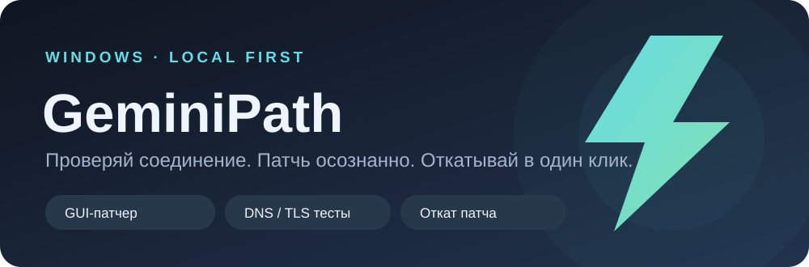

<p align="center"></p>

<p align="center">
  <a href="https://github.com/iwosw/gemini-path/releases/latest"></a>
  <a href="https://github.com/iwosw/gemini-path/actions/workflows/windows-installer.yml"></a>
  <a href="LICENSE"></a>
</p>

# GeminiPath

**Удобный патчер Antigravity для Windows с проверкой файла, резервной копией и откатом.** Дополнительно — диагностика соединения и экспериментальные способы работы с сетевыми сбоями Gemini. Никаких паролей Google программа не запрашивает.

> [!IMPORTANT]
> Клиентский патч может помочь только при отказе **внутри Antigravity**. Если Google отклоняет запрос на сервере из-за региона, аккаунта или лимита, патч не меняет решение Google. Проверяйте результат **реальным запросом к модели**.

## Установка за минуту

1. Скачайте **[GeminiPath-Setup-0.3.0.exe](https://github.com/iwosw/gemini-path/releases/latest/download/GeminiPath-Setup-0.3.0.exe)** из [Releases](https://github.com/iwosw/gemini-path/releases/latest).
2. Запустите установщик и пройдите обычный мастер. Он создаст ярлык в меню «Пуск»; ярлык на рабочем столе — по желанию. **Python и права администратора для установки не нужны.**
3. Полностью закройте Antigravity и откройте **GeminiPath**. Программа сама найдёт обычную установку Antigravity и покажет состояние файла.
4. Если написано **«Исходный файл · готов к патчу»**, нажмите **«Применить патч»**. Запустите Antigravity и проверьте, отвечает ли модель. Для отмены закройте Antigravity и нажмите **«Откатить»** в GeminiPath.

Если Antigravity стоит не в стандартной папке, нажмите **«Выбрать…»** и укажите его `language_server.exe`. Поддерживается Windows 10/11 x64; на версии Antigravity 2.8.1 проверено наличие сигнатуры. Другую версию программа изменит лишь тогда, когда найдёт **ровно одну** подходящую сигнатуру в исполняемом коде.

**Без установщика:** в исходниках есть `AntigravityPatcher.cmd` для запуска того же окна с Python 3.10+ и Tkinter. Самостоятельная сборка описана [ниже](#сборка-и-проверка).

## Что умеет

| Возможность | Как работает |
| --- | --- |
| Понятный статус | Показывает, найден ли Antigravity, совместима ли версия и установлен ли патч |
| Точечный патч | Меняет одну проверенную инструкцию только в `language_server.exe`, не настраивает Windows глобально |
| Резервная копия | Сохраняет оригинальный файл и SHA-256 **до** замены |
| Откат | Возвращает исходные байты; не перезаписывает самостоятельно обновившееся приложение |
| Диагностика сети | Отдельные [команды для DNS/TCP/HTTPS и DPI](docs/windows-network.md) |
| Сайт Gemini | [Отдельный профиль Chrome/Edge с бесплатным SNI-маршрутом](docs/browser-route.md), без VPN для всей Windows |
| API-релей | [Бесплатный экспериментальный Worker](worker/README.md) только для Antigravity CLI с ключом Gemini API |

Программа **не патчит сайт Gemini и старый Gemini CLI**. Старый вход личных аккаунтов в Gemini CLI через «Login with Google» [прекращён Google с 18 июня 2026 года](https://developers.google.com/gemini-code-assist/docs/deprecations/code-assist-individuals).

### Сайт Gemini из РФ без VPN-подписки

Нажмите **«Открыть Gemini в браузере»** в окне программы. Это **пробный** маршрут через бесплатный сторонний SNI-шлюз только для отдельного профиля браузера: программа проверит сертификаты Google перед запуском и не изменит сетевые настройки Windows. Анонимная проверка маршрута прошла, но **вход и отправку сообщений необходимо проверить со своим аккаунтом**. [Пошаговая инструкция и ограничения](docs/browser-route.md).

## Откат и удаление

В окне GeminiPath нажмите **«Откатить»**, предварительно закрыв Antigravity. Резервные копии установленной версии лежат в `%LOCALAPPDATA%\GeminiPath\patches` — **вне папки установщика**, поэтому обновление GeminiPath их не удаляет. Портативная версия из исходников сохраняет свои копии в `vendor/patches/` внутри распакованного проекта.

GeminiPath удаляется через **Параметры Windows → Приложения → GeminiPath**. Если патч ещё активен, мастер предупредит об этом; копия оригинала останется в `%LOCALAPPDATA%\GeminiPath\patches` даже после удаления программы. Вновь установив GeminiPath, можно выполнить откат. При обновлении самого Antigravity программа не заменяет новую версию старым бэкапом.

Если вы открывали сайт через отдельный браузер, его cookies сохраняются в `%LOCALAPPDATA%\GeminiPath\browser-profile`. После выхода из Google и закрытия этого браузера папку можно удалить вручную; установщик не удаляет данные браузерного профиля вместе с программой.

## Частые вопросы

<details><summary><b>После патча Google всё равно пишет «недоступно в регионе». Почему?</b></summary>

Локальный патч не меняет IP и не подменяет серверные ответы. Сначала проверьте точное сообщение в приложении. Для сетевой диагностики см. [инструкцию Windows](docs/windows-network.md); для внешнего узла без системного VPN — [сравнение вариантов](docs/free-egress.md).

</details>

<details><summary><b>Нужен ли VPN, Python или зарубежный сервер для патчера?</b></summary>

Для установленного GUI — нет. Внешний узел нужен только если проблему определяет выходной IP на сервере Google. Отдельный Worker подходит для **API-режима CLI**, но не является прокси для браузера или IDE.

</details>

<details><summary><b>Что если Antigravity обновился или файл не поддерживается?</b></summary>

Если подходящей единственной сигнатуры нет, программа оставляет файл без изменений. После обновления запустите «Проверить» снова. Если обновление заменило патч чистым файлом, «Откатить» уберёт старую запись о патче, не затрагивая новую версию.

</details>

<details><summary><b>Почему Windows или приложение могут ругаться на патч?</b></summary>

Изменение исполняемого файла нарушает его цифровую подпись. Если Antigravity перестал запускаться, закройте его и верните оригинал кнопкой «Откатить». Установщик GeminiPath собирается из открытого исходного кода в [GitHub Actions](.github/workflows/windows-installer.yml).

</details>

## Сборка и проверка

Исходники открыты; установщик собирается для Windows x64 в GitHub Actions через **PyInstaller + Inno Setup**. Для локальной сборки потребуются Python 3.13 и Inno Setup 6:

```powershell
py -m pip install -r requirements-build.txt
py tools/create_icon.py
py -m PyInstaller --noconfirm --clean --onefile --windowed --name GeminiPath --icon dist/GeminiPath.ico --distpath dist --workpath build --specpath . antigravity_gui.py
& "${env:ProgramFiles(x86)}\Inno Setup 6\ISCC.exe" installer\GeminiPath.iss
```

Тесты: `py -m unittest discover -s tests -v`. На машине с Antigravity можно дополнительно установить `$env:GEMINIPATH_REAL_APP_TEST='1'` в PowerShell и повторить команду: проверяется **копия** установленного файла, оригинал не трогается.

## Лицензии и источники

Код GeminiPath распространяется по [MIT](LICENSE). Идея проверки клиентского бинарника основана на [публичном исследовании сигнатуры](https://github.com/vezlin1/antigravity-bypass-russia/blob/main/src/core/opcodes.rs). Дополнительный сетевой режим загружает официальный [GoodbyeDPI](https://github.com/ValdikSS/GoodbyeDPI) по закреплённому SHA-256; его бинарники не включены в установщик и имеют отдельную лицензию Apache-2.0. [Antigravity имеет собственный список доступных стран](https://antigravity.google/docs/faq/).
